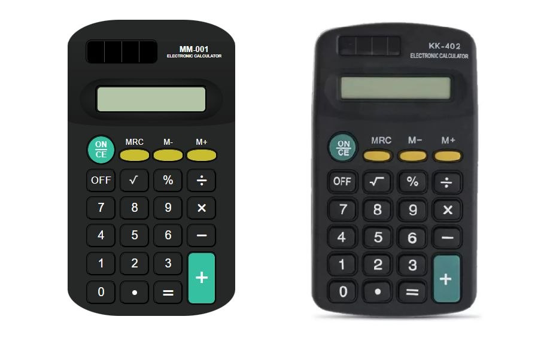

# Calculadora Clássica
Este é um projeto de recriação de uma das calculadoras mais clássicas do Brasil, com o objetivo de desenvolver habilidades de Front End utilizando JavaScript, HTML e CSS.

A calculadora é projetada para fornecer uma interface familiar aos usuários, imitando o design e a funcionalidade da calculadora clássica brasileira. Ela suporta as operações básicas de adição, subtração, multiplicação e divisão, bem como a capacidade de realizar cálculos com números decimais.

## Funcionalidades
* Operações básicas de adição, subtração, multiplicação e divisão.
* Capacidade de realizar cálculos com números decimais.
* Interface intuitiva e fácil de usar, inspirada na calculadora clássica brasileira.

## Tecnologias Utilizadas
* JavaScript: A linguagem de programação principal utilizada para a lógica e manipulação dos cálculos.
* HTML: Utilizado para a estruturação do conteúdo e criação dos elementos da interface.
* CSS: Utilizado para estilizar e dar vida à interface da calculadora.

## Como Utilizar
1. Faça o download ou clone o repositório do projeto.
2. Abra o arquivo index.html em um navegador da web compatível.
3. A calculadora será exibida na página.
4. Utilize os botões da calculadora para inserir os números e realizar as operações desejadas.
5. O resultado será exibido no visor da calculadora.
